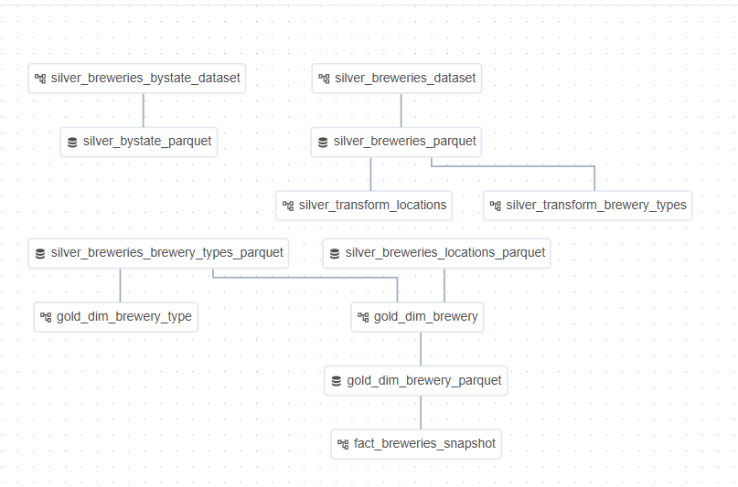

# Documentação do Airflow

Detalha as camadas, fluxo de dados e comportamento em resposta a alterações nos datasets.

## 1. Fluxo de dados

O fluxo de dados do repositório pode ser dividido em três camadas principais:

1. **Camada Silver**
    - Um DAG chamado `silver_breweries_dataset` lê arquivos brutos de cervejarias no bucket `raw-data` e, via `MinIOTransformListOperator`, gera o arquivo Parquet `silver_breweries_parquet` em `processed-data` 
    - Em seguida, há dois DAGs de transformação que disparam sempre que esse Parquet é atualizado:
        - `silver_transform_brewery_types` extrai e limpa a lista de tipos de cervejaria, gerando `silver_breweries_brewery_types_parquet`
        - `silver_transform_locations` extrai e normaliza informações de cidade, estado e país, gerando `silver_breweries_locations_parquet`            
    - Há ainda o DAG `silver_breweries_bystate_dataset`, que consome outra fonte bruta (por estado) e gera `silver_bystate_parquet`         
2. **Dimensão de Tipo de Cervejaria (Gold)**
    - O DAG `gold_dim_brewery_type` dispara sempre que `silver_breweries_brewery_types_parquet` é atualizado.
    - Ele usa o `GenericParquetTransformOperator` para ler o Parquet silver, executar a função `transform_brewery_type` (que cria chave surrogate e mantém somente `brewery_type_sk`, `brewery_type` e `description`) e gravar o resultado em `gold/{YYYY}/{MM}/{DD}/dim_brewery_type.parquet` no bucket `processed-data`.
    - O operador também registra o dataset Airflow `gold_dim_brewery_type_parquet` para orquestração de dependências 
3. **Dimensão de Cervejaria (Gold)**
    - O DAG `gold_dim_brewery` é disparado quando **ambos** `silver_breweries_brewery_types_parquet` **e** `silver_breweries_locations_parquet` ficam disponíveis.
    - Utiliza o `GoldBreweryDimOperator` para ler os dois Parquets silver, fazer o join entre tipos e localizações, enriquecer com chaves surrogate e gravar o output em `gold_dim_brewery_parquet` (parquet) no bucket `processed-data`, registrando também o dataset `gold_dim_brewery_parquet` 
4. **Tabela de Fato Snapshot (Gold)**
    - Finalmente, o DAG `fact_breweries_snapshot` dispara após a geração de `gold_dim_brewery_parquet`.
    - Com o `FactBreweriesSnapshotOperator`, é calculada uma snapshot diária (por exemplo, contagens ou status agregados das cervejarias) e escrita em `fact_breweries_snapshot_parquet` no bucket `processed-data`, com o dataset `fact_breweries_snapshot_parquet` sendo publicado para downstream 
**Orquestração (Airflow)**
- Sensores e dependências fazem o pipeline “pular” de Bronze → Silver → Gold:
    1. O DAG de ingestão (Bronze) produz arquivos em `raw-data`
    2. Os DAGs Silver são acionados (via schedule ou `S3KeySensor`) quando há novos objetos em `raw-data`
    3. O DAG Gold de fatos (`fact_breweries_snapshot`) depende do Dataset gerado pela dimensão Gold (`gold_dim_brewery_parquet`), garantindo que só rode após a camada Silver e as dimensões estarem prontas 
Esse design em três camadas assegura:
- **Rastreabilidade** (Bronze imutável)
- **Qualidade** (Silver valida e uniformiza)
- **Usabilidade** (Gold oferece tabelas prontas para consumo)

## 4. Estrutura de Pastas
A raiz do projeto brewery_data contém as pastas principais:  
• dags – onde ficam os arquivos que definem os workflows (DAGs) do Airflow  
• plugins – implementações customizadas de hooks, operators e sensores para o Airflow  
• logs – diretório em que o Airflow grava todos os registros de execução de tarefas  
• terraform – definições de infraestrutura como código (HCL) usadas para provisionar buckets no MinIO

Além dessas pastas, na raiz você ainda encontra: o arquivo docker-compose.yaml (que orquestra todos os containers), o arquivo .env (com as variáveis de ambiente), o diretório shellscripts (com scripts para subir, reconstruir e remover a stack) e o arquivo commands.md (que lista comandos rápidos para operação).
## 5. Execução e Monitoramento

- Inicie tudo com `./shellscripts/run.sh`.  
- Acesse o Airflow UI em http://localhost:8080.  
- Para monitoração detalhada do Celery: http://localhost:5555 (profile `flower`).  
- Examine logs locais ou via interface do Airflow.