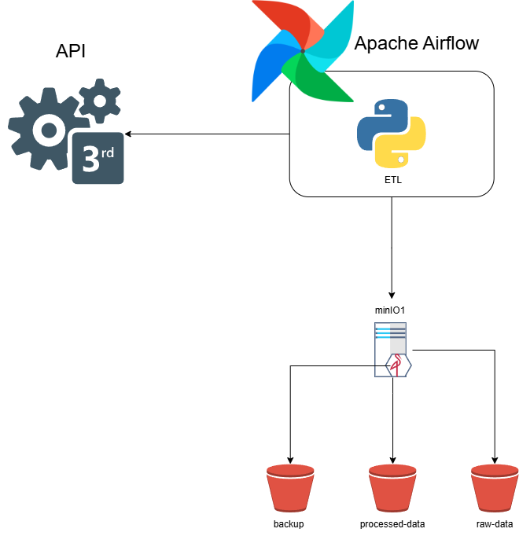

# Arquitetura da Aplicação

Este documento descreve os serviços orquestrados pelo `docker-compose.yaml` e suas responsabilidades.

## Visão Geral

A stack utiliza Docker Compose para gerenciar:

- **PostgreSQL**  
  Banco de metadados do Airflow (metadata database).

- **Redis**  
  Broker de mensagens para execução distribuída via CeleryExecutor.

- **MinIO**  
  Armazenamento de objetos compatível com S3 para datasets, logs e resultados.

- **Terraform**  
  Container que executa scripts HCL para criar buckets no MinIO.

- **Airflow**  
  - **airflow-init**: inicialização do banco, migrações e criação de usuário  
  - **airflow-webserver**: interface web (porta 8080)  
  - **airflow-scheduler**: agenda tarefas definidas nas DAGs  
  - **airflow-worker**: executa tarefas via Celery  
  - **airflow-triggerer**: gerencia sensores e triggers  
  - **flower**: painel de monitoramento Celery (porta 5555)
### Comportamento dos serviços
Na imagem a seguir temos o comportamento do container:

## Componentes e Funções

| Serviço             | Imagem                         | Função                                           |
|---------------------|--------------------------------|--------------------------------------------------|
| `postgres`          | `postgres:13`                  | Armazenamento de metadados do Airflow            |
| `redis`             | `redis:7.2-bookworm`           | Broker de mensagens para CeleryExecutor          |
| `minio`             | `minio/minio`                  | Armazenamento de objetos                         |
| `terraform`         | `hashicorp/terraform:latest`   | Provisionamento de buckets no MinIO              |
| `airflow-init`      | `apache/airflow:2.10.2`        | Inicializa DB, migra e cria usuário no Airflow   |
| `airflow-webserver` | `apache/airflow:2.10.2`        | UI do Airflow                                    |
| `airflow-scheduler` | `apache/airflow:2.10.2`        | Agenda e dispara DAGs                            |
| `airflow-worker`    | `apache/airflow:2.10.2`        | Processa tarefas distribuídas                    |
| `airflow-triggerer` | `apache/airflow:2.10.2`        | Executa sensores e triggers                      |
| `flower`            | `apache/airflow:2.10.2` (flower) | Monitor Celery                                   |

### Rede e Volumes

- **Rede**: `default` (driver `bridge`)  
- **Volumes**:  
  - `postgres-db-volume` → `/var/lib/postgresql/data`  
  - `minio-data` → `./data` local  

### Fluxo de Inicialização

1. **run.sh**: cria pastas (`dags`, `logs`, `plugins`, `config`, `terraform`)  
2. Sobe **postgres**, **redis** e **minio**  
3. Após o healthcheck do MinIO, o **terraform** cria buckets necessários  
4. Inicializa o Airflow via **airflow-init**  
5. Sobe **webserver**, **scheduler**, **worker** e **triggerer**  
6. Variáveis de conexão (API, MinIO) são carregadas no Airflow